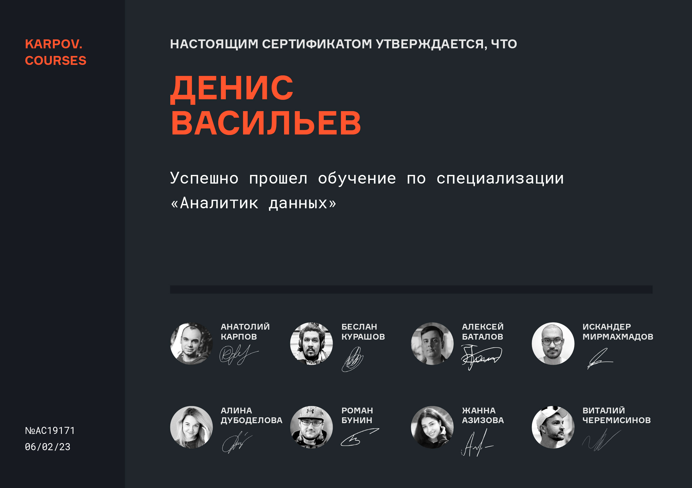

<h1>Привет!</h1>

Меня зовут Денис и я аналитик данных. Работаю с Python, SQL, таблицами и визуализицией данных.

Более 6 лет работал в сфере маркетинга, в качестве SEO-специалиста и аккаунт-менеджера, задачи тесно пересекались с анализом данных. Это и повлияло на изучение Data Science, в связи с чем прошел профессиональную переподготовку, где получил новые знания, навыки и смог сделать самостоятельно несколько проектов под  контролем наставника.

Например был опыт работы с компанией которая делает настольные игры, я  готовил коммерческое предложение и проводил встречу. На старте проекта посчитали прогноз трафика, лидов с учетом сезонности. Далее посчитали сколько компания заработает (ARPU умножили на прирост лидов) и пришли к тому, что SEO, им на данном этапе не окупится. Мне понравилось как с помощью данных и моделирования ситуации мы смогли сэкономить время и деньги. И теперь хочу расширить эту деятельность на все рекламные каналы и углубить свою экспертизу.

Ещё я веду [блог на медиум о прочитанных книгах](https://medium.com/@vasilew-denis "ссылка на блог")

:computer: Стек технологий: 
— Python (библиотека requests_html, pandas, pandahouse, numpy, seaborn, matplotlib); 
— SQL (Clickhouse, Tabix); 
— визуализация Redash, Google Data Studio, Tableau; 
— системы аналитики Яндекс.Метрика, Google Analytics; 
— прочее: screaming frog, rush analytics, figma (могу сделать прототип, откомментировать), miro, трелло, worksection, notion, яндекс.вебмастер, google search console, все программы google (особенно гугл таблицы, ВПР, сводные таблицы, функции).

:information_desk_person: Актуальное резюме: [ссылка](https://drive.google.com/file/d/1SrteCyKL0BgwyYDJ0LR0oPi_CstPsh4w/view?usp=sharing)

<h3 style='margin-bottom: 5px'>Отзывы о работе со мной и кейсы</h3>

[Компания Yota](https://www.it-agency.ru/academy/feedback-yota/)    
[Отзыв команды «Чистовье»](https://www.it-agency.ru/academy/chistove-seo-review/)   
[Aitarget One](https://vc.ru/it-agency/463100-kak-servis-aitarget-one-sohranil-potok-zayavok-v-krizis-s-pomoshchyu-kontenta-i-seo)  
[Отзыв компании Aristos](https://www.it-agency.ru/academy/aristos-review-seo/) 
:point_right: [Кейсы](https://github.com/vasilew/vasilew/blob/main/cases.md#%D0%BA%D0%B5%D0%B9%D1%81-1)

<h3>Последние пройденные курсы</h3>

