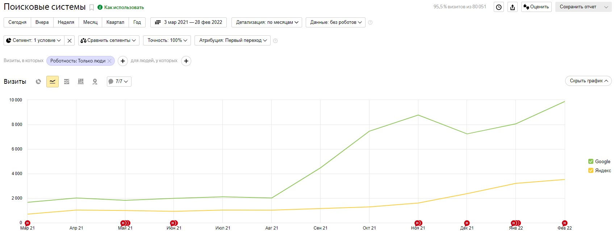
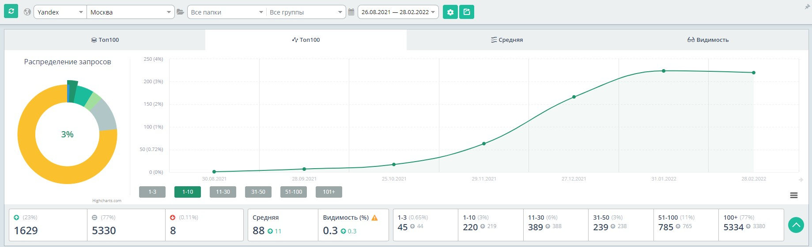
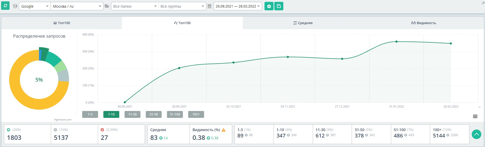
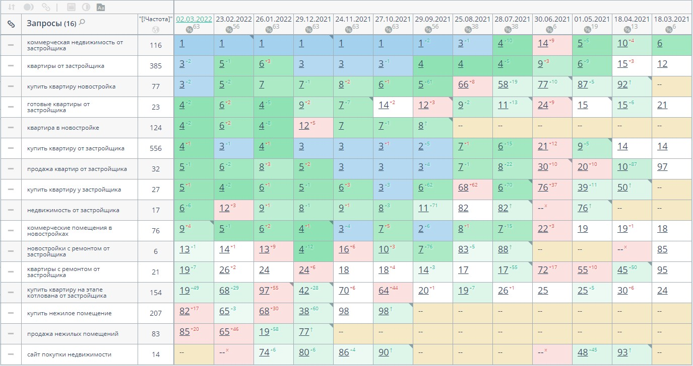
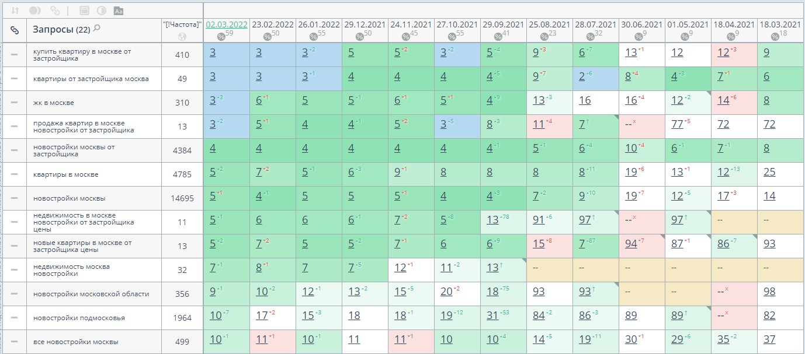

<h3>Кейс №1</h3>

**Сфера**: Агентство элитной недвижимости Москва (коммерческий проект)

**Задача**: Кратно вырастить трафик в Google, сдержать снижение трафика в Яндексе.

**Что сделал**: Провели технический аудит сайта и убрали самые критичные ошибки, пересобрали семантику и настроили генерацию новых страниц, настроили внутреннюю перелинковку и работу с внешними ссылками.

**Какой результат**: трафик из Google вырос в 5 раз, трафик в Яндексе остался на месте, квалифицированные лиды увеличились в 3 раза ежемесячно.

Google:

Yandex:

Общий трафик:

Позиции сайта:

<h3>Кейс №2</h3>

**Сфера**: Реселлер интернет-рекламы Россия (контентный проект)

**Задача**:
— соединить 2 блога на новом домене + сделать базовые работы по SEO;
— разработать контент-план и обучить авторов писать статьи с учетом SEO;
— увеличить трафик кратно на новой площадке по сравнению со старыми.

**Что сделал**:
— свели несколько блогов в один с помощью 301 редиректа;
— с нуля сделали новый сайт и зарелизили без ошибок;
— составили новый контент-план с потенциальным охватом X100 от текущего трафика.

**Какой результат**: Общий трафик вырос X5, 560 запросов вошло в Топ-10.

Трафик:

Позиции:

<h3>Кейс №3</h3>

**Сфера**: Застройщик Москва (коммерческий проект)

**Задача**: увеличить видимость сайта по не брендовым запросам точечно, есть узкая выборка запросов.

**Что сделал**:
— исправил технические ошибки (исправили дубли страниц, работал над доступностью страниц к индексации так как сайт на JS);
— улучшил метатеги, заголовки, текст на странице под ключевые запросы и интерес пользователей;
— расширил структуру сайта под готовый спрос.

**Какой результат**: Сайт, на котором ранее был только брендовый трафик, стал показываться по высокочастотным не брендовым запросам.

Позиции не брендовые запросы:

