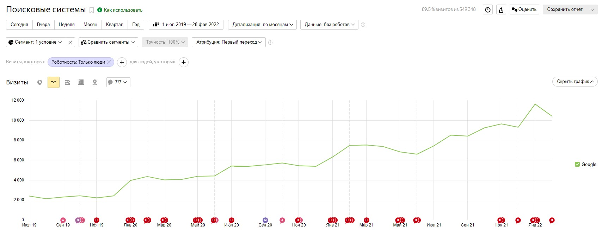
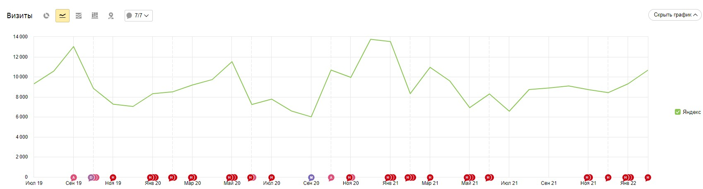
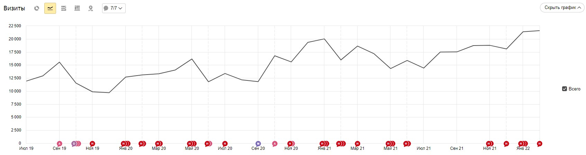
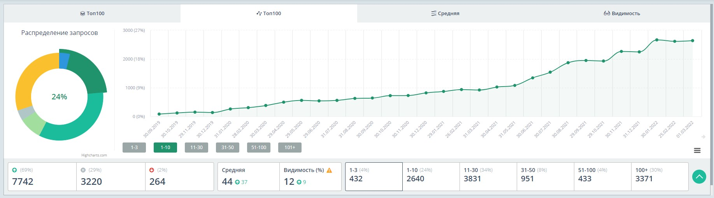

<h3>Кейс №1</h3>

**Сфера**: Агентство элитной недвижимости Москва (коммерческий проект)

**Задача**: Кратно вырастить трафик в Google, сдержать снижение трафика в Яндексе.

**Что сделал**: Провели технический аудит сайта и убрали самые критичные ошибки, пересобрали семантику и настроили генерацию новых страниц, настроили внутреннюю перелинковку и работу с внешними ссылками.

**Какой результат**: трафик из Google вырос в 5 раз, трафик в Яндексе остался на месте, квалифицированные лиды увеличились в 3 раза ежемесячно.

Google:

Yandex:

Общий трафик:

Позиции сайта:

